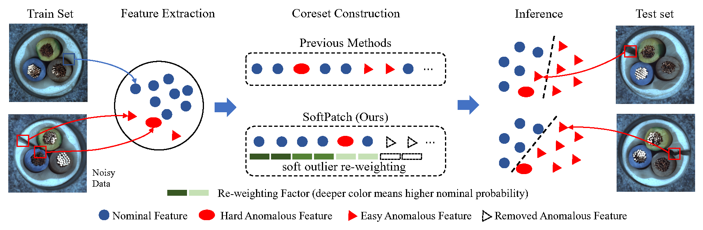

# AnomalyDetection-SoftPatch/SoftPatch+
This repository contains codes for the official implementation in PyTorch of NeurIPS 2022 paper "[SoftPatch: Unsupervised Anomaly Detection with Noisy Data](https://proceedings.neurips.cc//paper_files/paper/2022/hash/637a456d89289769ac1ab29617ef7213-Abstract-Conference.html)" and its improved version SoftPatch+.



## Quick Start

### Requirement
Our results were computed using Python 3.8 with packages and respective version noted in requirements.txt. 

### MVTec-AD

- **Default Training**. To train SoftPatch on [MVTec AD](https://www.mvtec.com/company/research/datasets/mvtec-ad) with 0.1 additional noise samples, run

```
datapath=/path_to_mvtec_folder/mvtec 
datasets=('bottle' 'cable' 'capsule' 'carpet' 'grid' 'hazelnut'
'leather' 'metal_nut' 'pill' 'screw' 'tile' 'toothbrush' 'transistor' 'wood' 'zipper')
dataset_flags=($(for dataset in "${datasets[@]}"; do echo '-d '$dataset; done))

python main.py --dataset mvtec --data_path ../../MVTec --noise 0.1  "${dataset_flags[@]}" --gpu 0
```
The default setting in ```run_mvtec.sh``` runs with 224x224 image size using a WideResNet50-backbone pretrained on ImageNet. 

- **Expected Performance**. Training on 1 GPU (NVIDIA Tesla V100 32GB) results in following performance. 

| Row Names        | image_auroc | pixel_auroc |
|------------------|-------------|-------------|
| mvtec_bottle     | 1.0000      | 0.9878      |
| mvtec_cable      | 0.9904      | 0.9862      |
| mvtec_capsule    | 0.9654      | 0.9883      |
| mvtec_carpet     | 0.9965      | 0.9920      |
| mvtec_grid       | 1.0000      | 0.9939      |
| mvtec_hazelnut   | 1.0000      | 0.9906      |
| mvtec_leather    | 1.0000      | 0.9931      |
| mvtec_metal_nut  | 0.9987      | 0.9845      |
| mvtec_pill       | 0.9562      | 0.9798      |
| mvtec_screw      | 0.9526      | 0.9944      |
| mvtec_tile       | 0.9866      | 0.9645      |
| mvtec_toothbrush | 0.9931      | 0.9860      |
| mvtec_transistor | 0.9974      | 0.9064      |
| mvtec_wood       | 0.9854      | 0.9714      |
| mvtec_zipper     | 0.9753      | 0.9892      |
| Mean             | 0.9865      | 0.9805      |

- **Parameter Setting**.

To choose other noise discriminator, use the ```--weight_method``` argument with ```'lof', 'nearest', 'gaussian' or 'lof_gpu'```. 'lof_gpu' supports computing LOF using the GPU which usually faster. 

To 


### BTAD
To train SoftPatch on [BTAD](https://www.kaggle.com/datasets/thtuan/btad-beantech-anomaly-detection), run:
```
datapath=/path_to_btad_folder/BTAD
datasets=('01' '02' '03')
dataset_flags=($(for dataset in "${datasets[@]}"; do echo '-d '$dataset; done))

python main.py --dataset btad --data_path ../../BTAD --noise 0  "${dataset_flags[@]}" --seed 0 \
--gpu 1 --resize 512 --imagesize 512 --sampling_ratio 0.01
```
The default setting in ```run_btad.sh``` runs with 512x512 image size using a WideResNet50-backbone pretrained on ImageNet.

| Row Names | image_auroc | pixel_auroc |
|-----------|-------------|-------------|
| btad_01   | 0.9981      | 0.9761      |
| btad_02   | 0.9343      | 0.9662      |
| btad_03   | 0.9969      | 0.9935      |
| Mean      | 0.9764      | 0.9786      |

# Comments
- Our codebase for the coreset construction builds heavily on [PatchCore](https://github.com/amazon-science/patchcore-inspection) codebase. Thanks for open-sourcing!

# Citation
Please cite the following paper if this dataset helps your project:
```
@misc{xisoftpatch,
  title={SoftPatch: Unsupervised Anomaly Detection with Noisy Data},
  author={Xi, Jiang and Liu, Jianlin and Wang, Jinbao and Nie, Qiang and Kai, WU and Liu, Yong and Wang, Chengjie and Zheng, Feng},
  booktitle={Advances in Neural Information Processing Systems}
}
```

# License
This project is licensed under the Apache-2.0 License.
